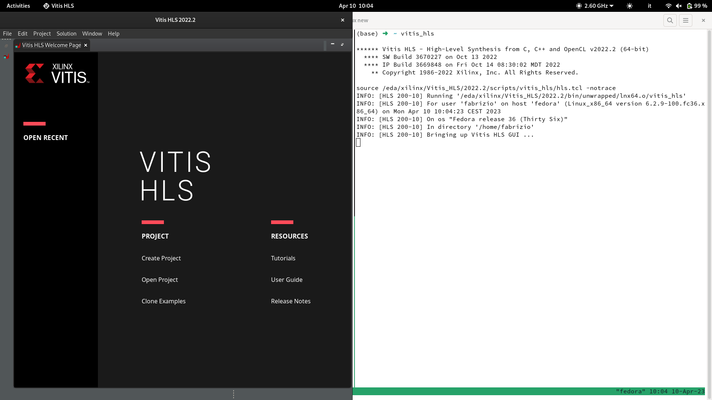

Fedora 36 is not officially supported by Xilinx (or AMD, I should say). Hence, I had to use some workarounds to install it on my work machine.

# Downloading the web installer

First of all, you need to download the [Vitis Linux web installer](https://www.xilinx.com/member/forms/download/xef.html?filename=Xilinx_Unified_2022.2_1014_8888_Lin64.bin), available at [this page](https://www.xilinx.com/support/download/index.html/content/xilinx/en/downloadNav/vitis.html). I chose the **Vitis Core Development Kit - 2022.2** package, and saved it in my `~/Downloads` directory.

# Running the installer

First of all, we make the installer executable:

```bash
fab@fedora:~ $ cd ~/Downloads
fab@fedora:Downloads $ chmod u+x ./Xilinx_Unified_2022.2_1014_8888_Lin64.bin
```

Then, we follow the instructions in [this post](https://support.xilinx.com/s/question/0D52E00007Evd2XSAR/vivado-xsetup-jvm-crash-for-full-installer?language=en_US) (search for `vlntmrx` answer). We extract the installer in a folder called `xilinx` using the following command:

```bash
fab@fedora:Downloads $ ./Xilinx_Unified_2022.2_1014_8888_Lin64.bin --target xilinx
```

The installer will run and crash, but a folder `xilinx` will be there with all the stuff that we need:

```bash
fab@fedora:Downloads $ cd xilinx
fab@fedora:xilinx $ ls
bin  data  hs_err_pid811776.log  lib  tps  xsetup
```

Now, we execute the following commands: 

```bash
# Removing the harzbuff library that is causing the crash
fab@fedora:xilinx $ rm ./tps/lnx64/jre11.0.11_9/lib/libharfbuzz.so
# Creating a symlink to my system harbuzz library.
fab@fedora:xilinx $ cp -s /lib64/libharfbuzz.so.0 ./tps/lnx64/jre11.0.11_9/lib/libharfbuzz.so
# Running the installer using xsetup.
fab@fedora:xilinx $ ./xsetup
```

The Xilinx GUI installer should start now. In my case, I choose `/eda/xilinx` as installation path, executing the following commands to create it:

```bash
fab@fedora:xilinx $ sudo mkdir /eda # Creating the folder.
fab@fedora:xilinx $ sudo chown fab /eda # Changing user ownership of the folder.
fab@fedora:xilinx $ sudo chgrp fab /eda # Changing group ownership of the folder.
fab@fedora:xilinx $ mkdir /eda/xilinx
```

In the GUI installer, provide `/eda/xilinx` as installation path.

# Vitis HLS GUI 

Now, we need to do some other things to allow the Vitis HLS GUI to start. We will follow the instructions shown in [this post](https://support.xilinx.com/s/question/0D54U00006TZa0tSAD/vitis-and-vitishls-on-fedora-37?language=en_US). 

First of all, we move to the Vitis HLS path where we need to change some thins: `/eda/xilin/Vitis_HLS/2022.2/lib/lnx64.o/Default`:

```bash
fab@fedora:xilinx $ cd /eda/xilin/Vitis_HLS/2022.2/lib/lnx64.o/Default
fab@fedora:Default $
```

Here, we rename the Xilinx version of `libstdc++.so.6` to `libstdc++.so.6.bak`:

```bash
fab@fedora:Default $ mv libstdc++.so.6 libstdc++.so.6.bak
```

Then, we copy the system version of `libstdc++.so.6` here via a symbolic link:

```bash
fab@fedora:Default $ ln -sf /usr/lib64/libstdc++.so.6 ./libstdc++.so.6
```

Now the GUI should work! Run in the terminal:

```bash
fab@fedora:Default $ cd
fab@fedora:~ $ source /eda/xilinx/Vitis_HLS/2022.2/settings64.sh
fab@fedora:~ $ vitis_hls
```

The following image is what you should see:



You can do the same for Vivado and Vitis. Thanks to the Xilinx community for the help!

